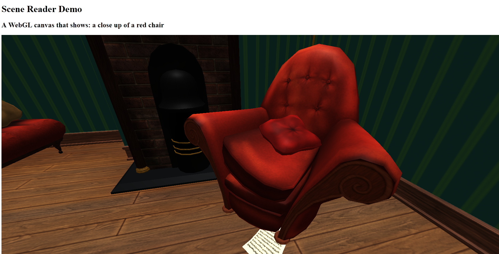

# Scene Reader Demo
This is an example application that illustrates how the [Microsoft Azure Cognitive Services Computer Vision API](https://azure.microsoft.com/en-us/services/cognitive-services/computer-vision/) can be used with [Three.js](https://threejs.org) to capture the contexts of a WebGL context and attempt to estimate what is on the screen. 

[Click to view a video of the code working on YouTube](https://www.youtube.com/watch?v=NaO0Q_p8cPs&feature=youtu.be)

## How it Works
As you can see if you play around with this, the captions are not particularly accurate, but in cases where the confidence of the recognition model is fairly high, provides some degree of assistance in capturing a visual object and attempting to better understand what a 3D scene contains. This could pretty easily be adapted to any other WebGL drawing context, since it's using the built-in [HTMLCanvasElement.toDataURL()](https://developer.mozilla.org/en-US/docs/Web/API/HTMLCanvasElement/toDataURL) function on the WebGL canvas to convert whatever is currently rendered on the canvas into a byte array that can be sent as a [blob](https://developer.mozilla.org/en-US/docs/Web/API/XMLHttpRequest/Sending_and_Receiving_Binary_Data) to Azure for processing. 

This was relatively straightforward to set up, despite Microsoft not having a JavaScript implementation sample on their site for sending locally stored data to the Cognitive Services API. I used `XMLHttpRequest` because that's what I'm familiar with, but you could use your request libraries of choice. 

The scene itself is a [glTF](https://www.khronos.org/gltf/) model that I downloaded from Sketchfab and loaded in using the three.js [GLTFLoader](https://threejs.org/docs/#examples/loaders/GLTFLoader). This took me a little while to get right, because glTF models can range in size so you may have to adjust the camera positioning if you want to try this with a different model. Hopefully in the future, I'll be able to make some updates to handle this more reasonably.

The reason that I chose to work with glTF for this project is because glTF is an extensible format, which means down the road, you could theoretically export accessibility captions directly into the file itself. This might not work well for large scenes, but I'm still thinking about how this could work. In any case, glTF is a cool standard file format for using 3D models on the web, and I wanted a chance to use the glTF format in a project, so here you have it. 

On pressing the 'P' key, the current camera data from the WebGL context is saved as a PNG image locally and sent away to Azure. Azure returns its best estimate as to what the thing is (objects won't get captions if they aren't detected) and if a caption is found, it updates the text at the top of the document to read what is present in the scene.

## Why I Made This
I attended [YGLF](https://lithuania.yglfconf.com/) a couple of weeks ago and was struck by [Adrian's](https://twitter.com/aardrian) talk on accessibility. Not only was I struck by the lack of awareness and implementation of accessible design and development on the 2D web, I realized that there is very little movement happening around 3D content (particularly of interest to me in the context of VR on the web). This is my first attempt at playing with some technologies that could be used to build a larger framework of assistive-device friendly 3D content online.

## Attributions
Three.js code from [https://github.com/mrdoob/three.js](https://github.com/mrdoob/three.js);

101 Dalmations - Roger's flat 3D model licensed under Creative Commons from user willdudley on Sketchfab: [https://sketchfab.com/3d-models/101-dalmatians-rogers-flat-dede088ea22647a1acc8aad453848eca](https://sketchfab.com/3d-models/101-dalmatians-rogers-flat-dede088ea22647a1acc8aad453848eca)

Chevrolet Camaro 3D model licensed under Creative Commons from user GregX on Sketchfab: [https://sketchfab.com/3d-models/chevrolet-camaro-dee5eed83d2442c49ce360e87ef08ef1](https://sketchfab.com/3d-models/chevrolet-camaro-dee5eed83d2442c49ce360e87ef08ef1)